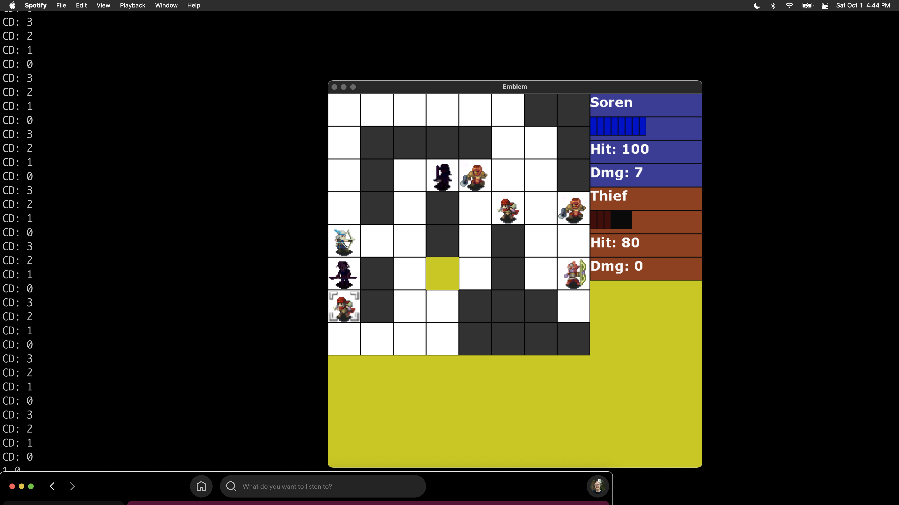

# Emblem
Alex Hartford

A small turn-based strategy game in the vein of Fire Emblem.

A learning project in Modern C++, with the goal of learning:
- The Command Pattern
- Functional Programming, where appropriate
- Classes and Composition
- Decoupling of responsibilities
- Dealing with a larger codebase

Credit to Bob Nystrom for the book <a href="https://gameprogrammingpatterns.com/">Game Programming Patterns</a>, 
Omar Cornut for <a href="https://github.com/ocornut/imgui">Imgui</a>,
David Reid for <a href="https://miniaud.io/">Miniaudio</a>,
SDL People for <a href="https://www.libsdl.org/">SDL</a>,
and to the folks on <a href="https://www.spriters-resource.com/">The Spriter's Resource</a> and Intelligent Systems for sprites.
