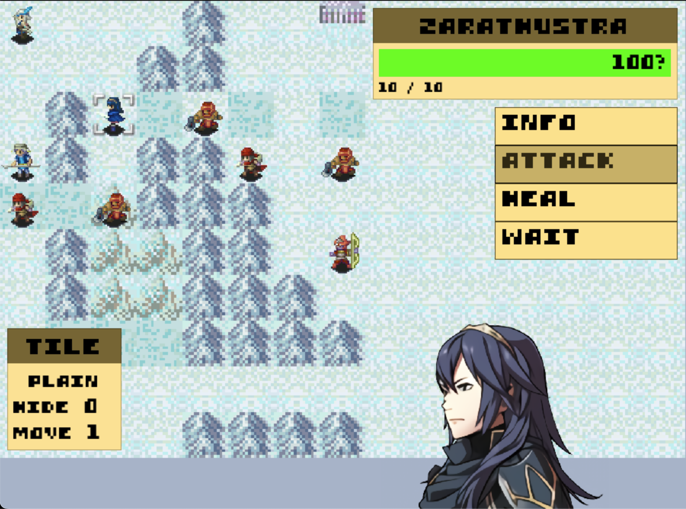

# Emblem
A micro-tactics RPG. Built in C++ using SDL, ImGui, MiniAudio.

A learning project with the following goals:
- Finish a game.
- Make something awesome.
- Become C++ wizard.

Credit to Bob Nystrom for the book <a href="https://gameprogrammingpatterns.com/">Game Programming Patterns</a>, 
Omar Cornut for <a href="https://github.com/ocornut/imgui">Imgui</a>,
David Reid for <a href="https://miniaud.io/">Miniaudio</a>,
SDL People for <a href="https://www.libsdl.org/">SDL</a>,
and to <a href="https://www.spriters-resource.com/">The Spriter's Resource</a> and Intelligent Systems for placeholder artwork.
